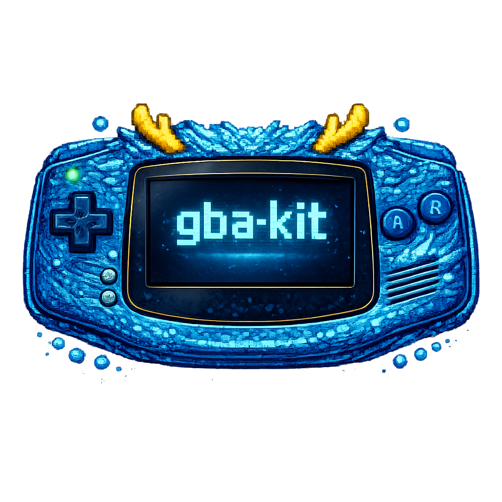
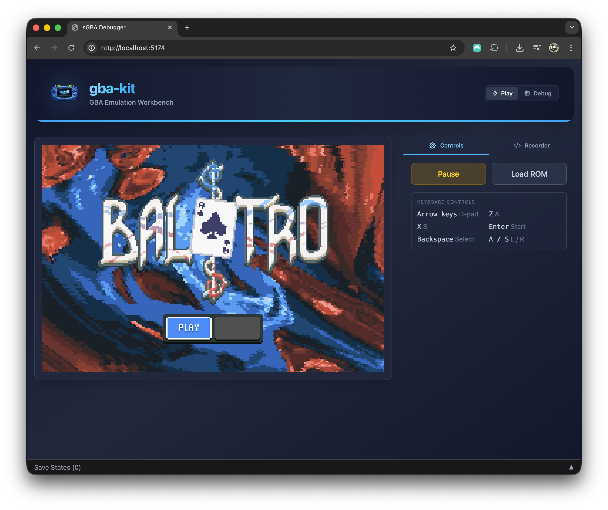
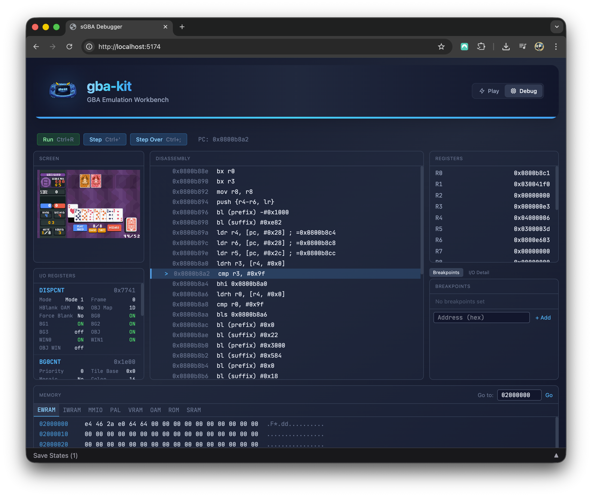

# gba-kit



[](https://github.com/macabeus/gba-kit/actions/workflows/ci.yml)
[](./LICENSE)
[](https://www.typescriptlang.org/)

> GBA as npm packages

`gba-kit` is a Game Boy Advance emulator built as a set of TypeScript packages. Use the ARM CPU core on its own, run full GBA hardware emulation, script headless sessions from Node.js, or embed a player in any web app. Each layer is a separate npm package.

<table align="center">
  <tr>
    <td align="center" width="50%">
      <kbd></kbd><br />
      <i>Full GBA emulator in TypeScript</i>
    </td>
    <td align="center" width="50%">
      <kbd></kbd><br />
      <i>Powerful debugging capabilities</i>
    </td>
  </tr>
</table>

[▶️ Play gba-kit on the browser](https://macabeus.github.io/gba-kit/)

## Why gba-kit?

- **TypeScript-native** — Emulator built entirely in TypeScript, designed for the JS/TS ecosystem
- **Modular npm packages** — Use just the ARM CPU core, the GBA emulator, or the Node.js, browser, and React runtimes
- **First-class scripting API** — Run headless emulation from Node.js scripts for automated testing, TAS, ROM research, and tooling
- **Built-in debugger** — Run the disassemblier, set breakpoints, open the memory viewer, inspect registers, and more

## Packages

| Package                                          | Description                                                                                 |
| ------------------------------------------------ | ------------------------------------------------------------------------------------------- |
| [`@gba-kit/arm-emulator`](packages/arm-emulator) | ARM7TDMI CPU emulator (Thumb + ARM instruction sets)                                        |
| [`@gba-kit/gba-emulator`](packages/gba-emulator) | Full GBA hardware emulation (PPU, APU, DMA, timers, interrupts, system bus)                 |
| [`@gba-kit/gba-node`](packages/gba-node)         | Headless Node.js runtime for scripted GBA emulation                                         |
| [`@gba-kit/gba-browser`](packages/gba-browser)   | Browser runtime for GBA emulation (Canvas rendering, keyboard input, IndexedDB save states) |
| [`@gba-kit/gba-react`](packages/gba-react)       | React hooks for GBA emulation (`useEmulator`, `useEmulatorCanvas`, `useEmulatorKeyboard`)   |
| [`@gba-kit/debug-info`](packages/debug-info)     | Parse ELF symbols + DWARF line tables (PC→source) for source-level debugging                |

## Apps

| App                              | Description                                                                              |
| -------------------------------- | ---------------------------------------------------------------------------------------- |
| [`@gba-kit/webapp`](apps/webapp) | Browser-based GBA debugger with disassembly, breakpoints, memory viewer, and save states |

## Scripting

gba-kit supports headless scripted emulation via `@gba-kit/gba-node`. See the **[Scripting Guide](docs/scripting.md)** for the full API reference and examples.

## Getting Started

### Prerequisites

- Node.js >= 22
- pnpm

A plain `git clone` is enough to build, run, and test everything. The repo has one
git submodule (the agbcc compiler under `packages/debug-info/test-projects/agbcc-min/agbcc`),
but it's only needed to **rebuild** the `@gba-kit/debug-info` test fixtures — not to
run the tests. Fetch it only if you intend to change those fixtures:

```bash
git submodule update --init --recursive
```

### Install and Build

```bash
pnpm install
pnpm turbo build
```

### Run Tests

```bash
pnpm turbo test
```

### Type Check

```bash
pnpm turbo check-types
```

### Lint

```bash
pnpm turbo lint
```

## Development

The monorepo uses [pnpm workspaces](https://pnpm.io/workspaces) with [Turborepo](https://turbo.build/) for task orchestration.

### Dev Server

```bash
pnpm dev
```

Starts the webapp dev server with hot-reload for all emulator packages (no rebuild needed).

### Project Structure

```
gba-kit/
  packages/
    arm-emulator/     # ARM7TDMI CPU core
    gba-emulator/     # GBA hardware (depends on arm-emulator)
    gba-node/         # Node.js runtime (depends on both)
    gba-browser/      # Browser runtime (Canvas, keyboard, IndexedDB)
    gba-react/        # React hooks (wraps gba-browser)
    debug-info/       # ELF/DWARF parser (PC→source)
  apps/
    webapp/           # Browser debugger UI + dev server
```

### Using with npm link

To consume these packages from another project during development:

```bash
# From gba-kit repo
pnpm turbo build
cd packages/arm-emulator && pnpm link --global
cd ../gba-emulator && pnpm link --global
cd ../gba-node && pnpm link --global
cd ../gba-browser && pnpm link --global
cd ../gba-react && pnpm link --global

# From consumer project
npm link @gba-kit/arm-emulator @gba-kit/gba-emulator @gba-kit/gba-node @gba-kit/gba-browser @gba-kit/gba-react
```

## Versioning

All packages share synchronized versions managed by [Changesets](https://github.com/changesets/changesets). When any package changes, all are bumped together.

```bash
pnpm changeset         # describe changes
pnpm changeset version # bump versions
pnpm changeset publish # publish to npm
```

## Legal

This emulator does not include any proprietary firmware or game ROMs. Users must provide their own legally obtained files.

gba-kit uses high-level emulation (HLE) for BIOS calls, so no BIOS dump is required.

## License

[MIT](./LICENSE)
