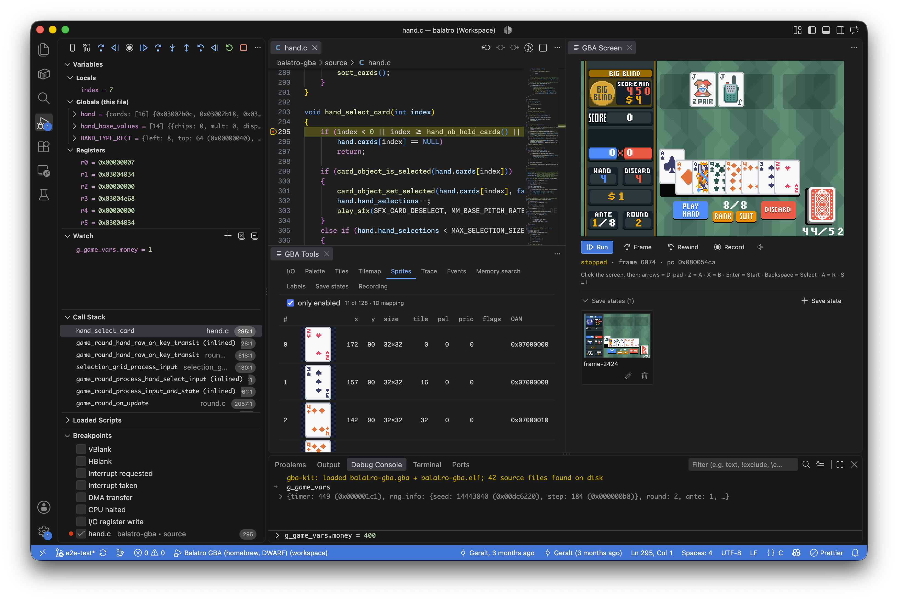

# GBA Debugger for VS Code

> 🕹️ Debug Game Boy Advance games where you write them

[](https://github.com/macabeus/gba-kit)
[](https://marketplace.visualstudio.com/items?itemName=macabeus.gba-kit-vscode)

<p align="center">
  
</p>

## Features

- Set breakpoints on lines, functions and addresses, or on memory being read or written
- Read and edit DWARF-typed variables, memory and registers
- Step by statement, instruction, frame or scanline, and step back
- Play the ROM in the editor, with a gamepad and sound
- Record your inputs and replay them exactly, or take the recording away as a script
- Keep save states with the project, and load one by the screen it was saved on
- Explore the PPU views, the I/O registers, the instruction trace and the event log

## Getting started

1. Build your ROM with debug info: the `.gba` and the ELF it was made from compiled with `-g`
2. Add a launch configuration:

   ```jsonc
   {
     "type": "gba-kit",
     "request": "launch",
     "name": "Debug GBA ROM",
     "rom": "${workspaceFolder}/build/game.gba",
     "elf": "${workspaceFolder}/build/game.elf",
     "cwd": "${workspaceFolder}",

     // Sit at the first instruction instead of letting the Screen panel start the game
     // "stopOnEntry": true,

     // Rewrite the paths inside the ELF, when the build ran somewhere else (Docker, CI)
     // "sourceMap": { "/build-container/src": "${workspaceFolder}/src" },

     // Where `.gba-kit/` keeps this project's labels, save states and recordings (default: `cwd`)
     // "projectDir": "${workspaceFolder}",

     // Debug anyway when the ELF is not this ROM's build; breakpoints then land in the wrong places
     // "allowElfMismatch": true,
   }
   ```

3. Start the debugger, and enjoy debugging the game 🎉

## Develop

```bash
pnpm --filter gba-kit-vscode build
pnpm --filter gba-kit-vscode test         # Unit tests
pnpm --filter gba-kit-vscode test:vscode  # Extension Development Host tests
pnpm --filter gba-kit-vscode package      # .vsix
```

> The extension is part of a monorepo that includes other modules for GBA development. [Check in the root of the repository for additional information.](https://github.com/macabeus/gba-kit)
